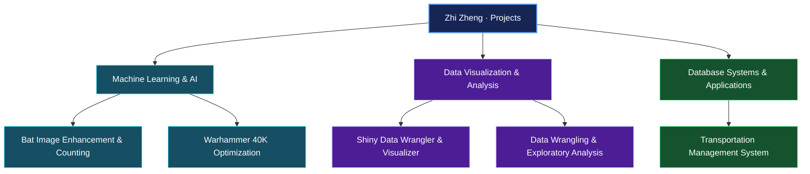

# Hi there, I'm Zhi Zheng

I build projects in machine learning, data visualization, and database systems.

  
  

## About Me

I am a graduate student at Florida Polytechnic University. My projects explore image enhancement, transportation management, and optimization. I enjoy turning data into useful insights and building tools that solve practical problems.

## Interests

- **Machine Learning & AI**: Developing models for image enhancement and object detection.
- **Data Visualization**: Building interactive tools to explore and communicate data.
- **Database Systems**: Designing and implementing efficient database solutions.
- **Project Management**: Focusing on resource management, risk management, and project execution.

## Project Map

How my technical interests connect to my projects:

## Project Highlights

### Bat Image Enhancement & Counting

A machine learning project combining blurry image enhancement with bat counting.

### Advanced Transportation Management System (TMS)

A transportation management system using R Shiny and ElephantSQL for fleet management, reporting, and analytics.

[Explore the repository](https://github.com/ZhiZheng0889/Advanced-Transportation-Management-System-TMS-)

### Genetic Algorithm for Warhammer 40K Optimization

An optimization project using genetic algorithms to explore Warhammer 40K Space Marine squad strategies.

## Featured Projects

- [GitPulse](https://github.com/ZhiZheng0889/GitPulse)
- [Shiny Data Wrangler & Visualizer](https://github.com/ZhiZheng0889/Shiny_Data_Wrangler_-_Visualizer)
- [Data Wrangling & Exploratory Data Analysis Final Project](https://github.com/ZhiZheng0889/FinalProjectDWEDA)

## Technical Skills

| Area | Technologies |
| --- | --- |
| Languages | Python, R, SQL |
| Machine Learning | TensorFlow, Keras |
| Applications & Visualization | Flask, R Shiny, Power BI |
| Development Tools | RStudio, Git, Docker |

## Contact

Connect with me on [LinkedIn](https://www.linkedin.com/in/zhi-zheng-337822120/) or [send me an email](mailto:zhizheng33782@gmail.com).

  
  

## GitHub Profile

[View my repositories and contribution history on GitHub](https://github.com/ZhiZheng0889).

---

## Recent Activity

Updated automatically each day from my public GitHub activity.

<!--RECENT_REPOS:START-->
- [AI-Adlib-Data-Analysis](https://github.com/ZhiZheng0889/AI-Adlib-Data-Analysis) - updated 2026-09-23
- [Tax-Accounting-](https://github.com/ZhiZheng0889/Tax-Accounting-) - updated 2026-09-23
- [GitPulse](https://github.com/ZhiZheng0889/GitPulse) - updated 2026-09-23 - a chrome extension to inform users of the activity of repo links before you click them.
- [Zhi_Zheng_final_project](https://github.com/ZhiZheng0889/Zhi_Zheng_final_project) - updated 2026-09-23 - Data Visualization and Reproducible Research final project - Zhi Zheng
- [Pokemon-Data-Shiny-App](https://github.com/ZhiZheng0889/Pokemon-Data-Shiny-App) - updated 2026-09-23
<!--RECENT_REPOS:END-->
